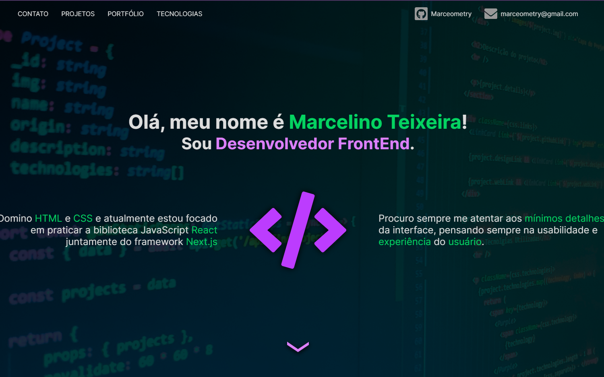

<h1 align="center"> Portfólio </h1>

  <a href="#-tecnologias">Tecnologias</a>&nbsp;&nbsp;&nbsp;|&nbsp;&nbsp;&nbsp;
  <a href="#-projeto">Projeto</a>&nbsp;&nbsp;&nbsp;|&nbsp;&nbsp;&nbsp;
  <a href="#-layout">Layout</a>

 

  

## 🚀 Tecnologias

Esse projeto foi desenvolvido com as seguintes tecnologias:

- [React](https://reactjs.org)
- [Next.js](https://nextjs.org/)
- [TypeScript](https://www.typescriptlang.org/)
- [MongoDB](https://www.mongodb.com/1)
- [Sass](https://sass-lang.com/)

## 💻 Projeto

`(ainda em processo de construção)`

<h4> Acesse em: https://marcelino-frontend.vercel.app </h4>

Este site foi pensado para ser feito com um design mais moderno do que a versão anterior do meu portfólio, e também foi desenvolvido para que eu pudesse aprender mais sobre [React](https://reactjs.org), [Next.js](https://nextjs.org/), webdesign, animações css, entre outros assuntos envolvendo o FrontEnd. Aqui, foram utilizados recursos como o [Nprogress](https://ricostacruz.com/nprogress/) para ilustrar o carregamento entre as páginas, o [React-Scroll](https://github.com/fisshy/react-scroll) para realizar scrolls suaves ao clicar na barra de navegação, entre outros detalhes que melhoram a experiência do usuário. Como banco de dados para armazenar as informações dos meus projetos, utilizei o [MongoDB](https://www.mongodb.com/1), pegando as informações através do método getStaticProps do [Next.js](https://nextjs.org/), e gerando as páginas individuais usando o getStaticPaths em conjunto, pois assim o carregamento das páginas se torna praticamente instantâneo, sem a necessidade de fazer requisições ao banco de dados toda vez que as páginas são acessadas.

## 🔖 Layout

Você pode visualizar o layout do projeto através [desse link](https://www.figma.com/file/JulJQK2kpLXpexpcqQNiwU/Portfolio). É necessário ter conta no [Figma](http://figma.com/) para acessá-lo.

---

<h4 align="center"> Feito com ♥ por Marcelino Teixeira </h4>
